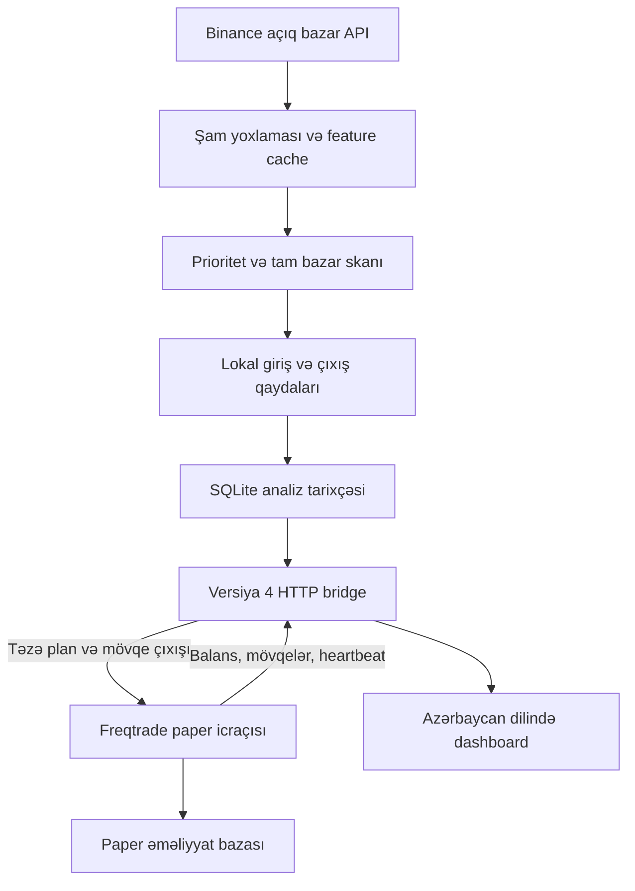

# Crypto Radar — paper trading

Python 3.12+ və **Freqtrade 2026.8** ilə lokal, deterministik futures strategiyası.
Repo və servis adları (`crypto-jev`) server yollarına görə dəyişdirilmir; köhnə JEV/AI kodu
tam silinib. Qərar qaydaları `app/strategy.py` daxilindəki `trend-reclaim-v1` strategiyasındadır.

Bu strategiyanın gəlirliliyi sübut edilməyib. Testlər proqramın davranışını yoxlayır,
gələcək qazancı yox. Real pul, exchange açarları və live rejim qadağandır.

## Qərarlar necə verilir?

Yalnız bağlanmış 15m, 1h və 4h şamlar işlənir. Hər period üçün minimum 250 şam,
vaxt ardıcıllığı, qiymətlər və təzəlik yoxlanır. Davam edən şam giriş qərarına daxil edilmir.

LONG üçün bütün şərtlər tələb olunur; SHORT üçün simmetrik tərsi tətbiq edilir:

1. Həm 1h, həm 4h: qiymət > EMA20 > EMA50 > EMA200; EMA50 yüksəlir.
2. Son bağlanmış 15m şam EMA20-ni yenicə yuxarı keçib: əvvəlki bağlanış əvvəlki
   EMA20-dən yuxarı deyil, cari bağlanış cari EMA20-dən yuxarıdır.
3. 15m MACD histogramı müsbətdir və artır; RSI 50–68-dir (SHORT: 32–50).
4. Həcm əvvəlki 20 şamın ortasından az deyil; EMA20-dən uzaqlıq maksimum 1 ATR-dir.
5. ATR/qiymət 0.1–5%; mark qiyməti son bağlanışdan maksimum 0.5 ATR uzaqdadır.
6. Spread, istiqamət üzrə funding, xərclər sonrası R:R və icra risk yoxlamaları keçir.

Bu göstəricilər ehtimal deyil. Hər qayda keçdi/keçmədi kimi
Azərbaycan dilində göstərilir. Trend namizədi təkbaşına giriş deyil; **Hazır siqnal**
yalnız bridge tərəfindən buraxılmış, təzə icra planını göstərir.

Girişdə stop məsafəsi 2 × 15m ATR, target 2R-dir. Plan order tag-də saxlanır və
hər analizdə yenidən dəyişdirilmir. Mövqe üçün 1h bağlanışı EMA50-ni əks istiqamətdə
keçərsə və 15m MACD histogramı bunu təsdiqləyərsə `thesis_exit` yaranır.
Məlumat çatmırsa giriş olmur və dashboard səbəbi göstərir (məs. "Trend yoxdur"), analitik çıxış HOLD olur.
Executor-a yalnız icra ediləcək siqnallar (giriş və ya mövqeyə bağlı çıxış) göndərilir. İcradakı stop/target
və maksimum 4 saat saxlanma qaydası analitik çıxışdan müstəqildir.

## Arxitektura



İki proses saxlanır: Dashboard/Engine və Freqtrade. Engine əməliyyat açmır;
Freqtrade son qiymət, spread, təkrar giriş, balans, margin və risk yoxlamalarını edir.
Bridge yalnız localhost HTTP + bearer token qəbul edir. Fərqli protokol versiyaları
və risk siyasətləri birlikdə işləməz: yeni girişlər bloklanır.

## Risk və təhlükəsizlik

- Planlanan stopda kapital risk büdcəsi 0.5%; hər mövqeyə maksimum 7% margin.
- Marginin riskə gedən hissəsi maksimum 50%; leverage tavanı 20×.
- Leverage stop məsafəsi və xərc büdcəsindən hesablanır.
- Xalis R:R minimum 1.5; komissiya/slippage ehtiyatı və mənfi funding daxil edilir.
- Gündəlik 3% zərər qapısı cari equity və günlük reallaşmış/reallaşmamış PnL istifadə edir.
- Təkrar siqnal eyni şamda restartdan sonra da trade tarixçəsi ilə bloklanır.
- Cooldown və Freqtrade StoplossGuard saxlanır. Mövqe sayı limitsizdir, hər mövqeyə
  və mövcud sərbəst vəsaitə risk yoxlaması tətbiq edilir. Korrelyasiya/ümumi portfel
  VaR limiti yoxdur; eyni anda çox mövqe ümumi riski artıra bilər.
- Telemetriya, heartbeat, disk yazısı və ya bazar məlumatı etibarsızdırsa yeni giriş yoxdur.
- Demo məlumat heç vaxt əməliyyat üçün istifadə edilmir. Exchange açarları paper-da da rədd edilir.

## Quraşdırma

```bash
python3.12 -m venv .venv
```

```bash
.venv/bin/python -m pip install -e '.[paper,test]'
```

```bash
cp .env.example .env
```

`.env` faylında dashboard istifadəçi/parolunu birlikdə təyin edin.

```bash
.venv/bin/python -m app.paper
```

Bir terminalda dashboard:

```bash
.venv/bin/python -m uvicorn app.main:app --host 127.0.0.1 --port 8082 --workers 1
```

Digər terminalda icraçı:

```bash
.venv/bin/python -m freqtrade trade --config user_data/config.paper.json --strategy-path user_data/strategies
```

Dashboard yalnız loopback-da açılır. Uzaqdan SSH tuneli və ya autentifikasiyalı HTTPS
reverse proxy istifadə edin; Freqtrade API-ni internetə açmayın. Windows üçün `run.cmd`
və `run-paper.cmd` mövcuddur.

### RSI + MACD heatmap radarı

`SYMBOLS=ALL` olanda bütün bazarlar tam analiz edilmir (gecikmə yaradırdı). Hər radar dövründə
[CoinGlass RSI Heatmap](https://www.coinglass.com/pro/i/RsiHeatMap) məntiqi ilə Binance bağlanmış 1h
şamlarından RSI və MACD(12,26,9) histogramı 1h və 4h üçün hesablanır (4h eyni şamlardan yığılır).
Bazar yalnız hər dörd göstərici eyni tərəfdədirsə seçilir: LONG üçün RSI 1h/4h ≥ `HEATMAP_TREND_RSI`
(default 55) və MACD histogramı 1h/4h > 0; SHORT tam əksi. RSI gücünə görə sıralanan ilk `HEATMAP_SIZE`
(default 40) bazar və bütün açıq mövqelər tam analizə gedir; prioritet lane də bu siyahını izləyir.

- Bir bazar = bir sorğu; ilk dövr ~1 dəqiqə, sonra şamlar növbəti 1h bağlanışına qədər cache-dən gəlir.
- Heatmap alınmasa radar 24s həcmə görə ilk `HEATMAP_SIZE` bazarı seçir və UI xəbərdarlıq göstərir.
- Dashboard-da "Heatmap radarı" filtri seçilmiş bazarları RSI 1h/4h ilə göstərir.

### UI-dan idarəetmə: sıfırlama, restart, git

Dashboard-da: **Bütün əməliyyatları sıfırla · 2,000 USDT**, **Yoxla**, **Git pull**, **Branch dəyiş**,
**Tətbiqi restart et**. Dashboard prosesləri özü idarə etmir; sorğunu `data/supervisor/request.json`
faylına yazır, icraçı yerinə yetirir və nəticəni `result.json`-a yazır (UI onu göstərir).

- Sıfırlama: Freqtrade dayanır, `freqtrade-paper.sqlite` silinmir, `data/backups/reset-<vaxt>/`
  qovluğuna köçürülür, `dry_run_wallet` 2000 edilir, servislər yenidən başlayır.
- Git: yalnız `fetch`, `pull --ff-only`, `switch`; commit edilməmiş dəyişiklik varsa imtina edir və
  heç nə dayandırılmır. Uğurlu pull/switch-dən sonra avtomatik restart olur.

**Linux server (systemd)** — bir dəfə quraşdırın:

```bash
sudo bash deploy/install-control.sh
```

Skript dashboard/freqtrade servis adlarını tapır (`crypto-jev-dashboard`/`crypto-jev-freqtrade` və ya
`crypto-jev`/`crypto-jev-paper`); fərqlidirsə arqument kimi verin:
`sudo bash deploy/install-control.sh my-dashboard.service my-freqtrade.service`.
`crypto-jev-control.path` sorğu faylını izləyir, root `crypto-jev-control.service` isə git/pip/upgrade-i
repo sahibi adından, `systemctl`-i root kimi işlədir. `pyproject.toml` və ya `requirements.lock` dəyişibsə
`pip install -e '.[paper]'` avtomatik icra olunur. Log: `journalctl -u crypto-jev-control.service`.

**Windows** — `run.cmd` / `run-paper.cmd` hər iki prosesi `python -m app.supervisor` altında işlədir;
restart zamanı skript asılılıqları və konfiqurasiyanı yeniləyib yeni kodla yenidən başladır.

## Serverdə yeniləmə

UI-dan idarəetmə quraşdırılıbsa dashboard-da **Git pull** kifayətdir. Əl ilə:

```bash
cd ~/crypto-jev
```

```bash
git pull --ff-only
```

```bash
.venv/bin/python -m pip install -e '.[paper]'
```

```bash
.venv/bin/python -m app.paper --upgrade
```

```bash
sudo systemctl restart crypto-jev-dashboard.service crypto-jev-freqtrade.service
```

Yalnız `SignalBridgeStrategy` konfiqurasiyası qəbul edilir. Köhnə `jev:` tag-lı açıq mövqe varsa
SL/TP planı oxunmur və executor onu `missing_risk_plan` ilə bağlayır; bundan qaçmaq üçün
yeniləmədən əvvəl köhnə mövqeləri bağlayın və ya "Bütün əməliyyatları sıfırla" düyməsini basın.
Bridge protokolu dəyişəndə **hər iki prosesi yeniləyin**.

## Performans və konfiqurasiya

Bir analiz bir market snapshot və lokal
indikator/qayda hesablamasıdır. Bağlanmış şamların feature cache-i saxlanır.
Real şəbəkədə performans benchmarkı və gəlirlilik backtesti bu dəyişiklik üçün aparılmayıb.

Tam universe radar-lane ilə, açıq mövqelər + son trend namizədləri + yüksək həcmli
bazarlar ayrı prioritet-lane ilə işlənir. Açıq mövqelər watchlist limitindən kəsilmir.
Hər nəticə diskə yazıldıqdan dərhal sonra yayımlanır; bütün skanın bitməsi gözlənilmir.

| Profil | Prioritet fasiləsi | Radar worker | Prioritet worker | TTL |
|---|---:|---:|---:|---:|
| conservative | 30 s | 2 | 1 | 180 s |
| balanced | 15 s | 4 | 2 | 120 s |
| aggressive | 10 s | 6 | 3 | 90 s |

`PERFORMANCE_PROFILE` yalnız skan tezliyini dəyişir, risk iştahını yox.
`SYMBOLS=ALL`, `SCAN_SECONDS=300`, `PRIORITY_SIZE=24`, `SYMBOL_TIMEOUT_SECONDS=35`
default-dur. Yüksək sayda açıq mövqe və ya exchange throttling prioritet büdcəsini aşa
bilər; dashboard bunu göstərir. TTL süni uzadılmır, köhnə siqnallar bloklanır.

Qayda override-ları `.env.example`-də `RULE_*` altında verilib: həcm, EMA uzaqlığı,
mark fərqi, ATR diapazonu, RSI tavanı, stop ATR və target R. Ədədlər məhdud diapazonlarda
yoxlanır. Qayda dəyişiklikləri üçün dashboard restartı; `CAPITAL_RISK`,
`MAX_MARGIN_FRACTION`, `MAX_LEVERAGE` və digər ortaq risk dəyişikliklərindən sonra
`app.paper --upgrade` və hər iki prosesin restartı tələb olunur. Mövcud mövqelərin
saxlanmış stop/target planı yeni ayarlardan dəyişmir.

## Monitorinq və proses məhdudiyyəti

Dashboard: qayda rədd səbəbləri, scan müddəti, analiz p50/p95, prioritet büdcəsi,
bridge lag və icra rədd sayğacları. `/api/status` dashboard autentifikasiyası ilə,
`/api/execution/health` bridge bearer token ilə qorunur. Tokenləri loglara yazmayın.

**Freqtrade prosesi dayananda paper SL/TP və çıxışlar icra olunmur.** Dashboard-un
sağlam olması bunun əvəzi deyil. Stop/target exchange-də deyil; restart nəzarəti
qəfil qiymət sıçrayışına və fasilə zamanı itkilərə zəmanət vermir.

`deploy/` systemd nümunələrində `Restart=always`, restart limiti, unprivileged user,
filesystem məhdudiyyəti var. Path/user/servis asılılıqlarını sizin serverə uyğunlaşdırın;
nümunələr `/opt/crypto-jev` və `cryptojev` hesabını istifadə edir. Mövcud
`crypto-jev-dashboard`/`crypto-jev-freqtrade` servisləri ilə paralel ikinci dəst açmayın.
`python -m app.monitor` lokal sağlamlığı yoxlayır və nasazlıqda nonzero exit verir;
timer nümunəsi mövcuddur. Ayrı hostdan proses/host monitorinqi əlavə edin.

## Yoxlama və məhdudiyyətlər

```bash
.venv/bin/python -m pytest -q
```

Offline browser testi (Playwright və Chromium tələb edir):

```bash
node tests/operations-ui.cjs
```

Testlər: simmetrik LONG/SHORT qaydaları, hər giriş qapısı, köhnə/future/nonfinite
məlumat, analitik çıxış, AI-siz engine, v3 rəddi, DB/config/tag miqrasiyası, real
Freqtrade risk callback-ləri, stop sürüşməsi, restart və mobil UI.

Bu bridge icra strategiyası `dry_run` xaricində başlamır. Tarixi replay/backtest
adapteri bu PR-da əlavə edilməyib. Forward paper nəticələrini komissiya/funding ilə
izləyin; üç nəticə və ya keçən unit test gəlirlilik sübutu deyil. News/on-chain
məlumat giriş deyil; dashboard order book yalnız göstərmə və icra spread yoxlaması üçündür.

## Open-source research / English overview

Reviewed [Freqtrade's official strategy collection](https://github.com/freqtrade/freqtrade-strategies).
Its authors describe the examples as educational starting points, not ready-to-use
profitable strategies. No third-party strategy was copied or vendored. The existing
Freqtrade executor is retained, with an original deterministic multi-timeframe EMA
reclaim strategy and symmetric entry gates. This avoids another bot process and
unvalidated dependencies. All external AI requests and probability-based gates are removed.

Historical design notes under `docs/` describe earlier versions and are not the
current operating specification; this README and `docs/local-strategy-migration.md` supersede them.
