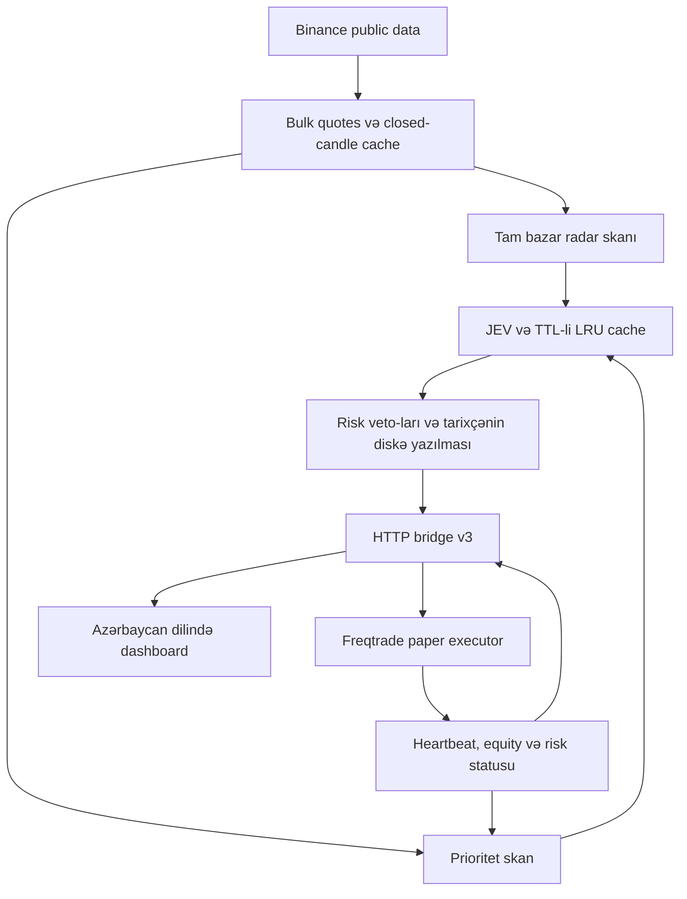

# Crypto JEV — paper futures terminalı

Python 3.12+ · Freqtrade **2026.8** · Azərbaycan dilində dashboard.

**JEV istiqaməti seçir.** Python yalnız yoxlayır, veto edir və mövqe ölçüsünü məhdudlaşdırır.
Yalnız virtual USDT ilə dry-run mümkündür. Live trading, real exchange key/secret və JEV
backtest/hyperopt strategiya başlanğıcında bloklanır. TypeSafe açarı yalnız JEV sorğuları üçündür.

## Quraşdırma

```bash
python3.12 -m venv .venv
.venv/bin/python -m pip install -e '.[paper,test]'
cp .env.example .env
```

`.env` içində `TYPESAFE_API_KEY` daxil edin. Sonra:

```bash
.venv/bin/python -m app.paper
```

Bu komanda yeni virtual hesab üçün 2000 USDT konfiqurasiyası, təsadüfi bridge/API credential-ları
və `.env` əlaqə parametrlərini yaradır. Mövcud konfiqurasiyanı əvəz etmir.
İki terminalda, repo kökündən:

```bash
.venv/bin/python -m uvicorn app.main:app --host 127.0.0.1 --port 8082 --workers 1
```

```bash
.venv/bin/python -m freqtrade trade --config user_data/config.paper.json --strategy-path user_data/strategies
```

Dashboard: <http://127.0.0.1:8082>. Windows: Python 3.12+ quraşdırın və `run-paper.cmd` işlədin.
Hər iki proses eyni virtual environment-də quraşdırılmış `app` paketindən istifadə edir.
Birdən çox engine worker işlətməyin. `DEMO_MODE=true` sintetik məlumat göstərir və heç bir giriş açmır.

## Arxitektura və məlumat axını



Engine/dashboard bir prosesdir; Freqtrade ayrıca prosesdir. Ortaq `app/risk.py` heç bir order
və istiqamət yaratmır. Freqtrade yekun qiymət, wallet, cooldown, risk və təkrar siqnal yoxlamasını edir.

### Adaptive scan

- `SYMBOLS=ALL`: aktiv USDT perpetual bazarları hər radar dövründə yenidən kəşf edilir.
- Radar bütün bazarları məhdud worker sayı ilə analiz edir. 500 bazar üçün 500 coroutine növbəsi yaradılmır.
- Ayrı priority worker-ları bütün açıq mövqeləri, son yüksək-confidence istiqamətli JEV cavablarını
  və 24 saatlıq quote volume sıralamasını izləyir. Açıq mövqelərə say limiti tətbiq edilmir;
  əlavə watchlist `PRIORITY_SIZE` ilə məhduddur. Açıq mövqelər mövcud discovery siyahısından çıxsa da yoxlanır.
- Eyni simvol üçün paralel analiz təkrarlanmır. Hər nəticə tarixçəyə yazıldıqdan dərhal sonra görünür;
  bütün skanın bitməsi gözlənilmir.
- Bir simvol üçün 35 saniyəlik deadline var. AI cavabından sonra bazar/position semantic context
  yenidən yoxlanır; dəyişibsə WAIT. Köhnə analizin timestamp-i kor-koranə yenilənmir.
- Hər siqnalda `observed_at`, `expires_at`, envelope-də `generated_at` var. İcra zamanı TTL
  və əlavə 15 saniyəlik bridge envelope freshness yenidən yoxlanır. TTL uzatmaq təhlükəsizliyi əvəz etmir.

### Sürət və cache

| Profil | Priority fasiləsi | Radar worker | Priority worker | Siqnal TTL |
|---|---:|---:|---:|---:|
| conservative | 30 s | 2 | 1 | 180 s |
| balanced (default) | 15 s | 4 | 2 | 120 s |
| aggressive | 10 s | 6 | 3 | 90 s |

Profil **skan sürətini** dəyişir; risk büdcəsini artırmır. Fasilələr dövr bitdikdən sonra hesablanır.
Məsələn, priority dövrü 8 saniyə çəkərsə balanced rejimdə təkrar interval təxminən 23 saniyədir.
Soyuq cache zamanı bütün bazarları yükləmək hələ də vaxt aparır. Binance üçün ortaq rate limiter,
weight əsasında gözləmə və 429/418 cooldown saxlanılır. Daha çox paralellik exchange limitini aşmaq icazəsi deyil.

Bulk bid/ask, mark/funding və server vaxtı 2 saniyə paylaşılır. Şam indikatorları yalnız bağlanmış
şam dəyişəndə yenidən hesablanır. JEV cache açarı prompt version, model, semantic context, position
və bütün timeframe close timestamp-lərini əhatə edir. Cache hit yeni bazar yoxlamalarını keçməlidir.
LRU ölçüsü default 3000, AI cavab TTL-i 300 saniyədir; TTL hit zamanı yenilənmir.

`AI_CACHE_PERSISTENT=true` validated JEV cavablarını mövcud `analysis.db`-də əlavə cədvəldə saxlayır.
Diskdə də ölçü/TTL/LRU limiti var. Prompt/model dəyişdikdə əvvəlki açarlar uyğun gəlmir; restart zamanı
schema və TTL yenidən yoxlanır. Default `false`: restart ilk JEV sorğularını yeniləyir, əlavə disk yazısı yoxdur.
Disk-cache xətası həmin analizi WAIT edir; tarixçə/control xətası girişləri bloklayır. Disk kilidi üçün
200 ms timeout var; storage bloklanması sonsuz gözləmə yaratmır.

Sübut edilən performans nəticəsi: 500 bazarlı bloklanmış radar testində ayrılmış priority worker
radarı gözləmədən nəticə paylaşır. `pytest -q -s tests/test_resilience.py -k priority_progresses`
yerli vaxt ölçüsünü göstərir. **Canlı JEV/Binance ilə uzunmüddətli fill-rate benchmark aparılmayıb**;
real sürət şəbəkə, JEV latency, rate limit və açıq mövqelərin sayından asılıdır. Priority dövrü TTL
büdcəsini aşırsa UI xəbərdarlıq göstərir. Heç bir gəlirlilik və ya siqnal icrası faizi vəd edilmir.

## Qərarlar və risk

İstifadə olunmayan texniki score çıxarılıb. EMA/RSI/MACD/volume semantic context olaraq JEV-ə verilir;
Python trendə əsasən LONG/SHORT yaratmır. Volatility, price gap, spread, funding, RSI və net R:R veto-ları qalır.
Entry üçün direction/momentum/regime/risk confidence default 0.90-dır; CLOSE default 0.85-dir.
JEV confidence kalibrasiya edilmiş gəlirlilik ehtimalı deyil. Leverage ayrıca JEV sualı deyil:
Python yalnız təsdiqlənmiş istiqamətin ölçüsünü stop məsafəsi, komissiyalar və mənfi funding əsasında hesablayır.
Bu, çoxvariantlı leverage cavabına əsassız 90% confidence qapısını aradan qaldırır.
Ən kiçik uyğun tam leverage seçilir; exchange və margin-risk tavanına çatanda stake azaldılır.
Uyğun risk planı yoxdursa giriş WAIT qalır. Freqtrade cari qiymət və exchange limitləri ilə hesabı yenidən yoxlayır.
Pause və entry risk veto-ları təzə, açıq trade ID-sinə bağlı CLOSE qərarını dayandırmır.

Ortaq risk hesabı, `e` giriş, `s` stop, `f` mənfi funding ehtiyatı üçün:

```text
loss_fraction = abs(e-s)/e + cost_per_side*(1+s/e) + f
leverage_target = ceil(capital_risk / (margin_fraction*loss_fraction))
leverage = min(max(1, target), planned_cap, exchange_max, 20, floor(0.50/loss_fraction))
margin = min(equity*0.07, equity*0.005/(loss_fraction*leverage), available, executor_limits)
```

Minimum stake risk büdcəsinə sığmırsa sıfır stake qaytarılır. Yekun confirmation real order amount ilə
stop riskini yenidən yoxlayır. Hard tavanlar: kapital riski 0.5%, margin 7%, margin itkisi 50%, leverage 20×.
`.env` ilə bu tavanları azaltmaq olar, yuxarı qaldırmaq bloklanır. Gap/slippage zamanı faktiki itki planı aşa bilər;
bu hesab dəqiq liquidation modeli deyil. Freqtrade əlavə liquidation buffer tətbiq edir.

Funding müsbət/ mənfi istiqamətə görə yalnız mümkün ödəniş kimi ehtiyata alınır; mümkün gəlir kredit edilmir.
Default bir funding period-un cari rate-i həm stop riskinə, həm R:R xərclərinə əlavə edilir.
Bu konservativ ehtiyatdır, gələcək funding rate/settlement cədvəlinin proqnozu deyil.
`FUNDING_RESERVE_PERIODS=0` ehtiyatı söndürür, funding veto-su və UI göstəricisi qalır.

Gündəlik limit: **UTC gününün reallaşmış PnL-i + mənfi açıq PnL**, cari marked equity-nin 3%-i ilə
müqayisə edilir. Müsbət açıq PnL reallaşmış gündəlik limit pozuntusunu silmir. Equity wallet + fresh
open-position PnL əsasında hesablanır; köhnə/missing mark girişləri bloklayır. Günlük realized history
Freqtrade DB-dən oxunur, restart limiti sıfırlamır. Bu high-water-mark drawdown deyil; cari equity həddidir.

Cooldown default 300 saniyədir, bağlanmış trade-lərdən bərpa edilir və gecəyarısını keçir. Freqtrade-in
StoplossGuard qoruması əlavə olaraq qalır. Eyni simvol/istiqamət/bağlanmış 15m şam ID-si DB-dəki
`enter_tag` vasitəsilə təkrar girişə qarşı qorunur. Wallet əlçatanlığı ümumi margin istifadəsini məhdudlaşdırır;
portfel korrelyasiyası və ayrıca ümumi risk büdcəsi bu versiyada modelləşdirilmir.

## Bridge, təhlükəsizlik və müşahidə

Protokol **v3** yalnız loopback HTTP və ən azı 32 simvolluq bearer token istifadə edir. Hər iki proses
risk policy hash-inə razılaşmalıdır. Yanlış version, mode, timestamp, pair, ID, NaN/Infinity, leverage,
stop geometry və pozulmuş payload fail-closed rədd edilir. Request/response ölçüsü məhduddur.

Freqtrade network işini tək background thread-də aparır: risk heartbeat POST, sonra signals GET.
Connection təkrar istifadə edilir; error zamanı 2/4/8/16/30 saniyə backoff var. Normal loop/pairlist
refresh 1 saniyədir; iki background mərhələ və şam yüklənməsi səbəbi ilə bu 1 saniyəlik fill SLA deyil.
15 saniyəlik heartbeat/telemetry yoxdursa entry yoxdur. Final callbacks köhnə bridge cache-ni də rədd edir.

Dashboard-un “Sistem sağlamlığı və gecikmələr” hissəsi bunları göstərir:

- Priority/radar dövr müddəti, per-symbol latency p50/p95, priority sayı, cache hit rate.
- Bridge sağlamlığı/lag, pause, daily loss, TTL, storage, confidence, funding və digər blok səbəbləri.
- Executor-un rejection sayğacları; bunlar callback cəhdləridir, unikal trade sayı deyil.

Structured log-lar `stage`, `symbol`, `error_type` verir; credential, raw upstream body və exception
mətnləri log-a çıxarılmır. Snapshot sayğacları proses restartında sıfırlanır; history, controls və trade-lər qalır.
Ətraflı sahələr `/api/status` daxilində `metrics`, `cache`, `bridge`, `execution.executor_risk` altındadır.

| Endpoint | Məqsəd / autentifikasiya |
|---|---|
| `GET /api/status` | Radar, metrics, risk/bridge status; dashboard auth |
| `GET /api/history` | Son 100 analiz; dashboard auth |
| `GET /api/execution/signals` | v3 siqnallar + RemotePairList pairs; bearer |
| `POST /api/execution/heartbeat` | Executor risk statusu; bearer |
| `GET /api/execution/health` | Fresh engine/telemetry/heartbeat yoxlaması, 200/503; bearer |
| `POST /api/execution/pause`, `/resume` | Persisted entry control; dashboard auth + `X-Crypto-Jev: 1` |
| `POST /api/scan` | Manual radar skanı, minimum 60 s; dashboard auth + custom header |
| `GET /health` | Sadə HTTP liveness; trading readiness deyil |

`.env`, `config.paper.json`, credential backup-lar və DB-lər git-ə daxil edilmir. Yeni credential faylları
POSIX-də 0600 ilə yaradılır, migration atomik replacement edir. Public giriş lazımdırsa HTTPS reverse proxy,
`DASHBOARD_USER` + `DASHBOARD_PASSWORD` və firewall istifadə edin; 8082/8083 loopback-da qalmalıdır.
Token URL/query string-ə qoyulmur. JEV açarı Freqtrade config-inə yazılmır.

## Mövcud istifadəçilər üçün migration

1. Dashboard-da yeni girişləri dayandırın. Açıq paper mövqeləri yoxlayın və qısa restart pəncərəsi seçin.
2. Prosesləri dayandırın; `.env`, `user_data/config.paper.json` və bütün `data/` qovluğunu backup edin.
   SQLite backup-ı proseslər dayanandan sonra edin; işlək DB faylını tək kopyalamaq düzgün snapshot deyil.
3. `git pull --ff-only` edin. Python 3.12+ environment-də `pip install -e '.[paper,test]'` işlədin.
4. Repo kökündə `python -m app.paper --upgrade` işlədin. Mövcud wallet DB, credential, symbols, DB URL
   və açıq mövqelər saxlanılır. Config backup avtomatik yaradılır; risk policy, loop/pairlist intervalı yenilənir.
5. Hər iki prosesi eyni versiya ilə başladın. v2/v3 qarışığı yeni girişləri bloklayır.
6. UI-də heartbeat, equity, bridge sağlamlığını yoxlayın. Sonra girişləri davam etdirin.

Mövcud `.env` **əvəz edilmir**. `SCAN_SECONDS=60` kimi əvvəlki explicit ayarlar qalır; bu indi radarın
fasiləsidir. Yeni ayarlar yoxdursa balanced default-ları tətbiq edilir. Mövcud `SIGNAL_TTL_SECONDS=120`
profilin TTL default-undan üstün tutulur; profillə dəyişməsini istəyirsinizsə bu sətri silin və ya boş qoyun.
Köhnə TTL çox aşağıdırsa, `PRIORITY_SCAN_SECONDS + SYMBOL_TIMEOUT_SECONDS < SIGNAL_TTL_SECONDS`
şərtini təmin edin (default 15 + 35 < 120). Risk `.env` ayarını dəyişəndə yenidən `--upgrade` edin; policy hash mismatch girişləri bloklayacaq.
`analysis.db`-yə yalnız əlavə cache cədvəli/index yaradılır. Köhnə analiz JSON-ları oxuna bilir.
Freqtrade DB schema-sına toxunulmur; 4 və 5 hissəli köhnə `enter_tag` SL/TP planları qəbul edilir.
Əvvəlki daha sıx stop framework initialization-dan sonra bir dəfə bərpa edilir və DB-də saxlanır.
**DB silmək, balansı sıfırlamaq və ya açıq mövqeləri bağlamaq tələb olunmur.**

## Serverdə 7/24 işlətmək

`deploy/crypto-jev.service` və `deploy/crypto-jev-paper.service` iki prosesi ayrıca supervise edir.
Nümunələr `/opt/crypto-jev`, `cryptojev` istifadəçisi və hazır `.venv` fərz edir. Kod owner-i root,
runtime DB qovluqları service istifadəçisi tərəfindən yazıla bilən olmalıdır. Credential faylları həmin
istifadəçiyə oxuma üçün verin. Daha sərt ayrılıq üçün ayrıca OS istifadəçiləri və ayrı writable qovluqlar seçin.
Paper service `.env`-i yükləmir və TypeSafe açarına environment vasitəsilə giriş almır.

```bash
sudo cp deploy/crypto-jev.service deploy/crypto-jev-paper.service /etc/systemd/system/
sudo systemctl daemon-reload
sudo systemctl enable --now crypto-jev.service crypto-jev-paper.service
sudo journalctl -u crypto-jev -u crypto-jev-paper -f
```

`Restart=always`, 3 saniyə restart fasiləsi, private tmp və filesystem/kernel hardening daxildir.
Dashboard restartı Freqtrade-i avtomatik dayandırmır: mövcud qoruma davam etməlidir.

**SL/TP proses səviyyəsindədir. Freqtrade dayanarsa virtual mövqelərin stop/target yoxlanması dayanır.**
Exchange-native stop yoxdur. Engine heartbeat entry-ləri bloklaya və problem göstərə bilər, amma ölmüş
executor-un SL/TP-sini icra edə bilməz. systemd process crash-i bərpa edir; donmuş prosesi yalnız
`Restart=always` aşkar etmir. Host/network dayanması ayrıca riskdir.

İstəyə bağlı monitor:

```bash
.venv/bin/python -m app.monitor
sudo cp deploy/crypto-jev-monitor.service deploy/crypto-jev-monitor.timer /etc/systemd/system/
sudo systemctl daemon-reload
sudo systemctl enable --now crypto-jev-monitor.timer
```

Checker 200/503 heartbeat statusundan çıxış kodu yaradır; token-i log-a çıxarmır. Timer hər 30 saniyə
local check edir. Bu nümunə bildiriş göndərmir və özbaşına trade/restart etmir. İstifadə etdiyiniz monitoring
sisteminə service failure alert qoşun; host-un itməsi üçün ayrı host-dan yoxlama lazımdır. Portları public açmayın.

## Konfiqurasiya və yoxlamalar

Bütün əsas ayarlar və default-lar `.env.example`-dadır. `PERFORMANCE_PROFILE`, priority worker/interval/size,
radar interval/parallelism, per-symbol deadline, signal/cache TTL, confidence-lər, bridge polling, spread,
funding, fee/slippage ehtiyatı, margin/risk/leverage/daily loss və cooldown override edilə bilər.
Yanlış, qeyri-sonlu və təhlükəsizlik tavanını aşan dəyərlər startup-da rədd edilir.

```bash
.venv/bin/python -m pytest -q
node --check app/static/app.js
```

211 backend test keçib; testlər real Freqtrade 2026.8 resolver/config/DB API ilə işləyir; exchange və AI cavabları mock-dur.
`tests/operations-ui.cjs` şəbəkəsiz dashboard smoke testidir. Playwright və Chromium tələb edir.
Bu mühitdə Chromium yüklənmədiyi üçün vizual browser yoxlaması tamamlanmayıb; JS sintaksis yoxlaması keçib.
`tests/terminal-ui.cjs` ayrıca canlı bazar UI yoxlamasıdır; real order yaratmır.

News, order-book depth və on-chain JEV girişləri unavailable olaraq qalır. Dashboard order book yalnız
operator görünüşüdür. JEV confidence gəlirlilik ehtimalı deyil. Backtest/hyperopt, live order və real
exchange credential dəstəyi əlavə edilməyib. Canlı paper soak testi istifadəçinin öz TypeSafe açarı ilə aparılmalıdır.

## English engineering notes

See [refactor analysis and change map](docs/refactor-2026-10-05.md) for the baseline findings,
file-by-file changes, safety decisions, validation evidence and remaining limits. The two-process model,
JEV-only direction, paper-only mode and persisted trade plans are preserved. Protocol v3 deliberately
rejects old executors; upgrade both processes together. No database reset or position reset is required.

Primary references: [Freqtrade callbacks](https://www.freqtrade.io/en/stable/strategy-callbacks/),
[REST API](https://www.freqtrade.io/en/stable/rest-api/), [leverage](https://www.freqtrade.io/en/stable/leverage/),
[TypeSafe System One API](https://docs.typesafe.ai/api).

## Leverage və hazır siqnal yeniləməsinə keçid

`MIN_LEVERAGE_CONFIDENCE` artıq istifadə edilmir; köhnə `.env` sətri qalsa belə girişləri bloklamır.
`MIN_AI_CONFIDENCE` və `MIN_CLOSE_CONFIDENCE` saxlanılır. Prompt versiyası dəyişdiyi üçün köhnə
JEV cache cavabları təkrar istifadə edilmir; tarixçə və açıq paper mövqelər silinmir.
Bridge v3 və `leverage_requested` sahəsi saxlanılır: sahə risk modulunun hesabladığı leverage cap-dır.
Validator 1–100 tam ədədi qəbul edir (köhnə mesajlara uyğunluq); risk policy hər zaman maksimum 20× tətbiq edir.
Hər iki prosesi yeniləyib restart edin; köhnə executor yeni tam leverage dəyərlərini rədd edə bilər.

“LONG / SHORT” JEV istiqamətini göstərir. “Hazır siqnal” isə yalnız təzə, etibarlı planı olan,
bridge giriş yoxlamalarını keçmiş siqnalları göstərir. Pause, TTL, telemetry, storage, funding və
cooldown veto-ları ayrıca görünür. Freqtrade son qiymət, balans və exchange yoxlamasında yenə girişi rədd edə bilər.
Bu filtr fill zəmanəti deyil. Səhv pair/plan producer-də rədd edilir və diaqnostikada sayılır.

Mövcud serverdə service adları `crypto-jev-dashboard.service` və `crypto-jev-freqtrade.service` olduqda:

```bash
cd ~/crypto-jev
git pull --ff-only
sudo systemctl restart crypto-jev-dashboard.service
sudo systemctl restart crypto-jev-freqtrade.service
```

Data qovluğunu və trade DB-ni silmək tələb olunmur.

## Order zərəri araşdırması / audit

[5 oktyabr log araşdırması](docs/order-review-2026-10-05.md): real Freqtrade ilə aşkar edilmiş PnL API
uyğunsuzluğu və SHORT stopun təkrar yuvarlaqlaşdırılma xətası düzəldilib. Mövcud daha sıx stoplar
saxlanılır; upgrade onları genişləndirmir. Sabit SL artıq hər tick yenidən çevrilmir.

JEV xətaları `reason_code` ilə (`http_401`, `http_429`, `schema_distribution`, `transport` və s.) loglanır;
raw upstream body/credential loglanmır. Uyğun analiz üçün `entry_analysis`, yekun entry üçün
`entry_approved`, SL qurularkən `protective_plan` strukturlaşdırılmış hadisələri yazılır.
Bunlar JEV confidence-in win probability olduğunu göstərmir.

Tarixçə və orderləri silmədən, DB-yə yazmadan son əməliyyatların qərar kontekstini çıxartmaq üçün:

```bash
.venv/bin/python -m app.audit --hours 6
```

Nəticə `data/jev-audit.json`-dur: həmin vaxtda açılmış trade simvollarının son 10,000 uyğun
analizini və trade sahələrini çıxarır. Açar, config və raw error mətni çıxarılmır.
Sıx skanda aid analiz limitdən kənarda qala bilər; audit yoxdursa qərarın doğruluğunu iddia etməyin.
DB-lər silinibsə audit əvvəlki trade/analizi geri gətirmir. Gəlirlilik üçün ayrıca gələcək paper nəticələri
lazımdır; üç itkiyə uyğun threshold optimizasiyası tətbiq edilməyib.

## GitHub inteqrasiyası: aiolimiter

[mjpieters/aiolimiter](https://github.com/mjpieters/aiolimiter) (MIT, pinned 1.3.0) JEV HTTP sorğularına
inteqrasiya edilib. Bir Engine/event loop üçün bir `AsyncLimiter` var; radar, priority və retry-lər
ortaq limitdən keçir. Startup burst yoxdur. `JEV_REQUESTS_PER_SECOND=2` konservativ yerli default-dur,
TypeSafe planının rəsmi quota-sı və ya gəlirlilik ayarı deyil; öz planınıza uyğun azaldın/artırın (0.1–20).

401/403 bütün simvollar üçün 300 saniyə; transport xətası 5 saniyə fasilə yaradır.
429/529/502/503/504 cavablarında `Retry-After` saniyə və HTTP-date formatında nəzərə alınır.
30 saniyədən uzun gecikmə olduqda worker gözləyib TTL-ni yemir: WAIT qaytarır və növbəti skanlar
ortaq fasiləyə əməl edir. Artıq göndərilmiş paralel sorğular ləğv edilmir. Bu, xidmət/key/schema problemi
olduqda istiqamət uydurmur və provider problemini özü düzəltmir.

`/api/status` daxilində `jev_health` request/suppression sayını, son error kodunu və fasilə müddətini göstərir.
Yeni dependency üçün restart-dan əvvəl `.venv/bin/python -m pip install -e '.[paper]'` icra edin.
[Upstream usage](https://aiolimiter.readthedocs.io/en/stable/) və real async/cancellation testləri izlənilib.
İnteqrasiya infrastrukturu yaxşılaşdırır; qazanan ticarət strategiyası təqdim etmir.
