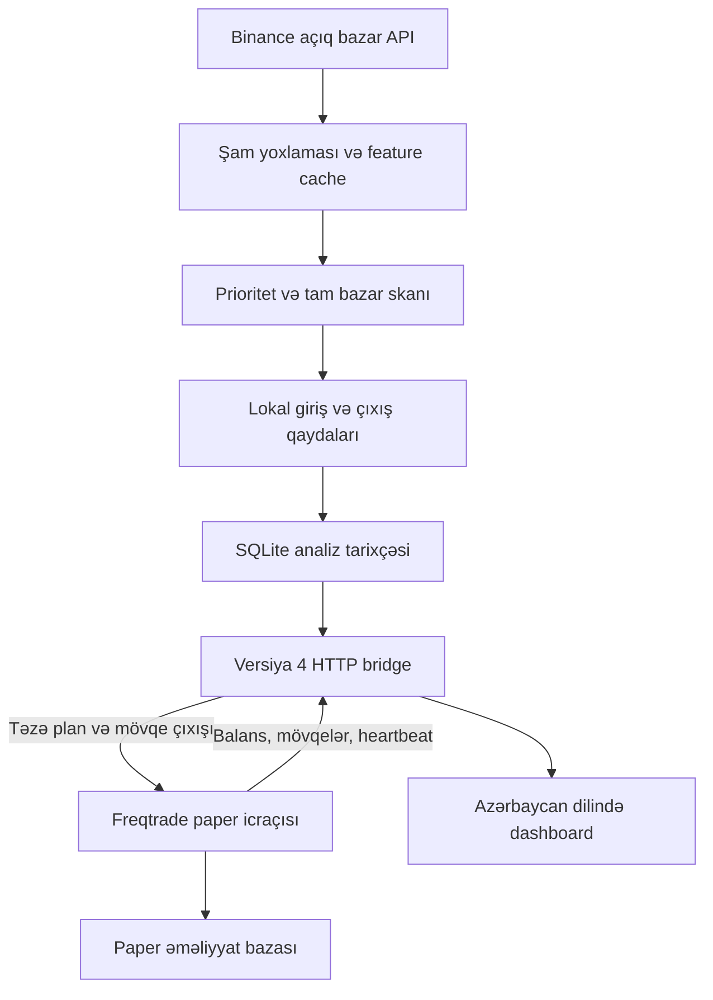

# Crypto Radar — paper trading

Python 3.12+ və **Freqtrade 2026.8** ilə lokal, deterministik futures strategiyası.
Repo adı geriyə uyğunluq üçün `crypto-jev` qalır. **JEV / TypeSafe çağırışları, model,
API açarı, AI cavab cache-i və confidence qapıları çıxarılıb.** Qərar qaydaları
`app/strategy.py` daxilindəki `trend-reclaim-v1` strategiyasındadır.

Bu strategiyanın gəlirliliyi sübut edilməyib. Testlər proqramın davranışını yoxlayır,
gələcək qazancı yox. Real pul, exchange açarları və live rejim qadağandır.

## Qərarlar necə verilir?

Yalnız bağlanmış 15m, 1h və 4h şamlar işlənir. Hər period üçün minimum 250 şam,
vaxt ardıcıllığı, qiymətlər və təzəlik yoxlanır. Davam edən şam giriş qərarına daxil edilmir.

LONG üçün bütün şərtlər tələb olunur; SHORT üçün simmetrik tərsi tətbiq edilir:

1. Həm 1h, həm 4h: qiymət > EMA20 > EMA50 > EMA200; EMA50 yüksəlir.
2. Son bağlanmış 15m şam EMA20-ni yenicə yuxarı keçib: əvvəlki bağlanış əvvəlki
   EMA20-dən yuxarı deyil, cari bağlanış cari EMA20-dən yuxarıdır.
3. 15m MACD histogramı müsbətdir və artır; RSI 50–68-dir (SHORT: 32–50).
4. Həcm əvvəlki 20 şamın ortasından az deyil; EMA20-dən uzaqlıq maksimum 1 ATR-dir.
5. ATR/qiymət 0.1–5%; mark qiyməti son bağlanışdan maksimum 0.5 ATR uzaqdadır.
6. Spread, istiqamət üzrə funding, xərclər sonrası R:R və icra risk yoxlamaları keçir.

Bu göstəricilər ehtimal və ya “90% confidence” deyil. Hər qayda keçdi/keçmədi kimi
Azərbaycan dilində göstərilir. Trend namizədi təkbaşına giriş deyil; **Hazır siqnal**
yalnız bridge tərəfindən buraxılmış, təzə icra planını göstərir.

Girişdə stop məsafəsi 2 × 15m ATR, target 2R-dir. Plan order tag-də saxlanır və
hər analizdə yenidən dəyişdirilmir. Mövqe üçün 1h bağlanışı EMA50-ni əks istiqamətdə
keçərsə və 15m MACD histogramı bunu təsdiqləyərsə `thesis_exit` yaranır.
Məlumat çatmırsa yeni giriş WAIT, analitik çıxış HOLD olur. İcradakı stop/target
və maksimum 4 saat saxlanma qaydası analitik çıxışdan müstəqildir.

## Arxitektura



İki proses saxlanır: Dashboard/Engine və Freqtrade. Engine əməliyyat açmır;
Freqtrade son qiymət, spread, təkrar giriş, balans, margin və risk yoxlamalarını edir.
Bridge yalnız localhost HTTP + bearer token qəbul edir. Fərqli protokol versiyaları
və risk siyasətləri birlikdə işləməz: yeni girişlər bloklanır.

## Risk və təhlükəsizlik

- Planlanan stopda kapital risk büdcəsi 0.5%; hər mövqeyə maksimum 7% margin.
- Marginin riskə gedən hissəsi maksimum 50%; leverage tavanı 20×.
- Leverage AI və ya confidence əsasında deyil, stop məsafəsi və xərc büdcəsindən hesablanır.
- Xalis R:R minimum 1.5; komissiya/slippage ehtiyatı və mənfi funding daxil edilir.
- Gündəlik 3% zərər qapısı cari equity və günlük reallaşmış/reallaşmamış PnL istifadə edir.
- Təkrar siqnal eyni şamda restartdan sonra da trade tarixçəsi ilə bloklanır.
- Cooldown və Freqtrade StoplossGuard saxlanır. Mövqe sayı limitsizdir, hər mövqeyə
  və mövcud sərbəst vəsaitə risk yoxlaması tətbiq edilir. Korrelyasiya/ümumi portfel
  VaR limiti yoxdur; eyni anda çox mövqe ümumi riski artıra bilər.
- Telemetriya, heartbeat, disk yazısı və ya bazar məlumatı etibarsızdırsa yeni giriş yoxdur.
- Demo məlumat heç vaxt əməliyyat üçün istifadə edilmir. Exchange açarları paper-da da rədd edilir.

## Quraşdırma

```bash
python3.12 -m venv .venv
```

```bash
.venv/bin/python -m pip install -e '.[paper,test]'
```

```bash
cp .env.example .env
```

`.env` faylında dashboard istifadəçi/parolunu birlikdə təyin edin. JEV açarı tələb edilmir.

```bash
.venv/bin/python -m app.paper
```

Bir terminalda dashboard:

```bash
.venv/bin/python -m uvicorn app.main:app --host 127.0.0.1 --port 8082 --workers 1
```

Digər terminalda icraçı:

```bash
.venv/bin/python -m freqtrade trade --config user_data/config.paper.json --strategy-path user_data/strategies
```

Dashboard yalnız loopback-da açılır. Uzaqdan SSH tuneli və ya autentifikasiyalı HTTPS
reverse proxy istifadə edin; Freqtrade API-ni internetə açmayın. Windows üçün `run.cmd`
və `run-paper.cmd` mövcuddur.

### UI-dan idarəetmə (supervisor)

`run.cmd` / `run-paper.cmd` dashboard-u və Freqtrade-i `python -m app.supervisor` altında işlədir.
Bu rejimdə dashboard-da aşağıdakı düymələr aktivdir:

- **Bütün əməliyyatları sıfırla · 2,000 USDT** — Freqtrade dayandırılır, `data/freqtrade-paper.sqlite`
  silinmir, `data/backups/reset-<vaxt>/` qovluğuna köçürülür, `dry_run_wallet` 2000 edilir və hər şey yenidən başlayır.
- **Yoxla / Git pull / Branch dəyiş** — yalnız `git fetch`, `git pull --ff-only` və `git switch`;
  commit edilməmiş dəyişiklik varsa imtina edir. Uğurlu pull/switch-dən sonra tətbiq avtomatik restart olur.
- **Tətbiqi restart et** — supervisor hər iki prosesi dayandırıb `3` kodu ilə çıxır; skript asılılıqları
  yeniləyir, konfiqurasiyanı `--upgrade` edir və yeni kodla (supervisor daxil) yenidən başladır.

Dashboard prosesləri özü idarə etmir: sorğunu `data/supervisor/request.json` faylına yazır, supervisor icra edir.
Supervisor-suz (məs. systemd) işə salındıqda bu düymələr deaktivdir.

## Mövcud quraşdırmadan miqrasiya

**DB silmək və balansı sıfırlamaq lazım deyil.** `.env`, `data/analysis.db`,
`data/freqtrade-paper.sqlite` və mövcud paper mövqeləri qorunur.
Köhnə AI cache cədvəli varsa toxunulmur, amma artıq oxunmur/yazılmır.
Tarixçədəki köhnə analizlər qalır, təkrar icraya buraxılmır.

Serverinizdəki mövcud servis adları ilə əmrləri ardıcıl icra edin:

```bash
cd ~/crypto-jev
```

```bash
sudo systemctl stop crypto-jev-freqtrade.service crypto-jev-dashboard.service
```

```bash
git fetch origin
```

```bash
git switch fix-stoploss-creep
```

```bash
git pull --ff-only origin fix-stoploss-creep
```

```bash
.venv/bin/python -m pip install -e '.[paper,test]'
```

```bash
.venv/bin/python -m app.paper --upgrade
```

Upgrade config-də strategiyanı `SignalBridgeStrategy`, bridge ayarlarını `signal_bridge`,
risk ayarlarını `risk_policy` edir. Tokenlər, API hesabı, simvollar, wallet və DB yolu
qorunur; yalnız config üçün mövcud atomik backup mexanizmi qalır. Əməliyyat bazası
silinmir və kopyalanmır. Köhnə TYPESAFE_*, AI_CACHE_*, MIN_AI_CONFIDENCE və
MIN_CLOSE_CONFIDENCE env açarları istifadə edilmir; onları `.env`-dən silə bilərsiniz.
`RECENT_CONFIDENCE_SECONDS` yerinə `RECENT_SIGNAL_SECONDS` var, default 900.

```bash
sudo systemctl start crypto-jev-dashboard.service
```

```bash
sudo systemctl start crypto-jev-freqtrade.service
```

```bash
sudo systemctl status crypto-jev-dashboard.service crypto-jev-freqtrade.service --no-pager
```

```bash
sudo journalctl -u crypto-jev-freqtrade.service -n 100 --no-pager
```

Hardcoded `--strategy JevBridgeStrategy` ilə köhnə servislər üçün kiçik uyğunluq
sinfi saxlanıb: yeni lokal strategiyanı miras alır, heç bir AI kodu işləmir. Köhnə
`jev:` order tag-ləri yalnız mövcud mövqelərin SL/TP-sini oxumaq üçün qəbul edilir;
yeni tag-lər `rule:` ilə başlayır. Bu adlar xarici JEV asılılığı deyil.
Bridge v3 prosesləri v4 ilə giriş aça bilməz; **hər iki prosesi yeniləyin**.

## Performans və konfiqurasiya

JEV şəbəkə gözləməsi tam aradan qalxıb. Bir analiz bir market snapshot və lokal
indikator/qayda hesablamasıdır. Bağlanmış şamların feature cache-i saxlanır.
Real şəbəkədə performans benchmarkı və gəlirlilik backtesti bu dəyişiklik üçün aparılmayıb.

Tam universe radar-lane ilə, açıq mövqelər + son trend namizədləri + yüksək həcmli
bazarlar ayrı prioritet-lane ilə işlənir. Açıq mövqelər watchlist limitindən kəsilmir.
Hər nəticə diskə yazıldıqdan dərhal sonra yayımlanır; bütün skanın bitməsi gözlənilmir.

| Profil | Prioritet fasiləsi | Radar worker | Prioritet worker | TTL |
|---|---:|---:|---:|---:|
| conservative | 30 s | 2 | 1 | 180 s |
| balanced | 15 s | 4 | 2 | 120 s |
| aggressive | 10 s | 6 | 3 | 90 s |

`PERFORMANCE_PROFILE` yalnız skan tezliyini dəyişir, risk iştahını yox.
`SYMBOLS=ALL`, `SCAN_SECONDS=300`, `PRIORITY_SIZE=24`, `SYMBOL_TIMEOUT_SECONDS=35`
default-dur. Yüksək sayda açıq mövqe və ya exchange throttling prioritet büdcəsini aşa
bilər; dashboard bunu göstərir. TTL süni uzadılmır, köhnə siqnallar bloklanır.

Qayda override-ları `.env.example`-də `RULE_*` altında verilib: həcm, EMA uzaqlığı,
mark fərqi, ATR diapazonu, RSI tavanı, stop ATR və target R. Ədədlər məhdud diapazonlarda
yoxlanır. Qayda dəyişiklikləri üçün dashboard restartı; `CAPITAL_RISK`,
`MAX_MARGIN_FRACTION`, `MAX_LEVERAGE` və digər ortaq risk dəyişikliklərindən sonra
`app.paper --upgrade` və hər iki prosesin restartı tələb olunur. Mövcud mövqelərin
saxlanmış stop/target planı yeni ayarlardan dəyişmir.

## Monitorinq və proses məhdudiyyəti

Dashboard: qayda rədd səbəbləri, scan müddəti, analiz p50/p95, prioritet büdcəsi,
bridge lag və icra rədd sayğacları. `/api/status` dashboard autentifikasiyası ilə,
`/api/execution/health` bridge bearer token ilə qorunur. Tokenləri loglara yazmayın.

**Freqtrade prosesi dayananda paper SL/TP və çıxışlar icra olunmur.** Dashboard-un
sağlam olması bunun əvəzi deyil. Stop/target exchange-də deyil; restart nəzarəti
qəfil qiymət sıçrayışına və fasilə zamanı itkilərə zəmanət vermir.

`deploy/` systemd nümunələrində `Restart=always`, restart limiti, unprivileged user,
filesystem məhdudiyyəti var. Path/user/servis asılılıqlarını sizin serverə uyğunlaşdırın;
nümunələr `/opt/crypto-jev` və `cryptojev` hesabını istifadə edir. Mövcud
`crypto-jev-dashboard`/`crypto-jev-freqtrade` servisləri ilə paralel ikinci dəst açmayın.
`python -m app.monitor` lokal sağlamlığı yoxlayır və nasazlıqda nonzero exit verir;
timer nümunəsi mövcuddur. Ayrı hostdan proses/host monitorinqi əlavə edin.

## Yoxlama və məhdudiyyətlər

```bash
.venv/bin/python -m pytest -q
```

Offline browser testi (Playwright və Chromium tələb edir):

```bash
node tests/operations-ui.cjs
```

Testlər: simmetrik LONG/SHORT qaydaları, hər giriş qapısı, köhnə/future/nonfinite
məlumat, analitik çıxış, AI-siz engine, v3 rəddi, DB/config/tag miqrasiyası, real
Freqtrade risk callback-ləri, stop sürüşməsi, restart və mobil UI.

Bu bridge icra strategiyası `dry_run` xaricində başlamır. Tarixi replay/backtest
adapteri bu PR-da əlavə edilməyib. Forward paper nəticələrini komissiya/funding ilə
izləyin; üç nəticə və ya keçən unit test gəlirlilik sübutu deyil. News/on-chain
məlumat giriş deyil; dashboard order book yalnız göstərmə və icra spread yoxlaması üçündür.

## Open-source research / English overview

Reviewed [Freqtrade's official strategy collection](https://github.com/freqtrade/freqtrade-strategies).
Its authors describe the examples as educational starting points, not ready-to-use
profitable strategies. No third-party strategy was copied or vendored. The existing
Freqtrade executor is retained, with an original deterministic multi-timeframe EMA
reclaim strategy and symmetric entry gates. This avoids another bot process and
unvalidated dependencies. All external AI requests and probability-based gates are removed.

Historical design notes under `docs/` describe earlier versions and are not the
current operating specification; this README and `docs/local-strategy-migration.md` supersede them.
